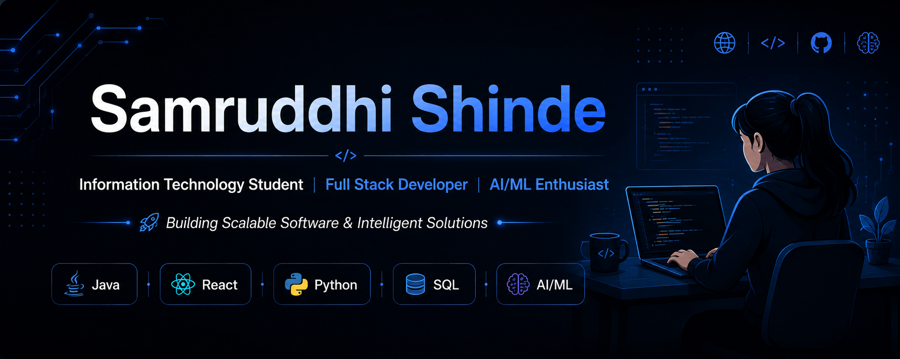

> 💡 Passionate about Full Stack Development, AI/ML, and building scalable software solutions.

# Hi 👋, I'm Samruddhi Shinde

### Information Technology Student @ VIT Pune

**Full Stack Developer • AI/ML Enthusiast**

*🚀 Building Scalable Software & Intelligent Solutions*

  
  
  

---

## 👩‍💻 About Me

I'm an Information Technology student at **Vishwakarma Institute of Technology (VIT), Pune**, passionate about building scalable web applications and AI-powered solutions.

I enjoy transforming ideas into practical software through clean code, thoughtful design, and continuous learning.

- 🌱 Currently learning **Data Structures & Algorithms, Backend Engineering, and System Design**
- 💻 Interested in **Full Stack Development, Artificial Intelligence, and Machine Learning**
- 🚀 Building projects that solve real-world problems
- 🎯 Goal: Become a Software Development Engineer

---

## 🛠️ Tech Stack

### 💻 Languages

### 🎨 Frontend

### ⚙️ Backend

### 🗄️ Database

### 🤖 AI / ML

### 🛠️ Tools

---

## 🚀 Featured Projects

### 🩺 Healthcare Appointment Manager

Production-ready healthcare appointment platform with role-based authentication, appointment scheduling, AI-powered visit summaries, and modern full-stack architecture.

---

### 🛡️ Sentinel SOC

AI-powered Security Operations Center dashboard for anomaly detection and cyber threat visualization.

---

### 🤖 Maternal Mental Health Prediction

Machine Learning application for predicting maternal mental health risks.

---

### 💊 Pharmacy Management System

Medicine inventory, billing, and stock management system.

---

## 🌱 Currently Learning

- Advanced Data Structures & Algorithms
- System Design Fundamentals
- Cloud Computing
- Backend Architecture
- AI-powered Full Stack Applications

---
